Für die Ver- und Entschlüsselung ist notwendig:

Eine einmalige Installation des Skriptes (keine Drittanbietersoftware benötigt, keine Webservices o.ä. werden verwendet, nur rein in Windows/PowerShell verfügbare Mittel)

Je Zertifikat, eine einmalige Erstellung oder Importierung

Die Importierung benötigt die Zertifikat-Datei (*.pfx) und ein Passwort

Für die Verschlüsselung wird das zu verwendete Zertifikat benötigt und der zu verschlüsselnde Text oder Datei.

Beim Entschlüsseln wird nur der CMS-String (Ergebnis der Verschlüsselung) benötigt.

 

# Installation
PowerShell öffnen (benötigt keine Admin-PowerShell) und folgenden Code kopieren / einfügen und ausführen


```
Set-ExecutionPolicy Bypass -Scope Process -Force; [System.Net.ServicePointManager]::SecurityProtocol = [System.Net.ServicePointManager]::SecurityProtocol -bor 3072; iex ((New-Object System.Net.WebClient).DownloadString(’https://raw.githubusercontent.com/TeamSLAH/Sup-Crypt/main/install.ps1'))
```

Anschließend die PowerShell schließen und neu öffnen (damit wird das Skript geladen).

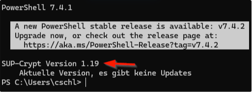

> Updates werden automatisch beim öffnen der PowerShell erkannt es erfolgt ein Hinweis.
> Ein Update kann mit Sup-Update eingeleitet werden.
> 
> Sup-WhatsNew zeigt Details über das Update und bietet an, es durchzuführen.
> Nach einem Update muss die PowerShell neu gestartet werden.

# Zertifikat importieren

1. Zertifikat downloaden / speichern (aus E-Mail, Teams, …)
2. Passwort muss vorliegen

**Möglichkeit 1** : Dateipfad direkt angeben


**Möglichkeit 2** : Ohne Dateipfad

`Sup-ImportCertificate` ohne Parameter.

Hier werden mehrere Ordner nach Zertifikaten durchsucht und aufgelistet

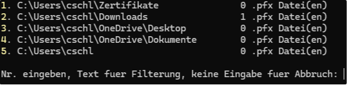

Nun den Ordner wählen, in diesem Fall 2 für Downloads

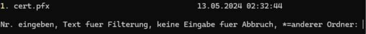

Nun die Datei wählen, in diesem Fall natürlich die 1 weil es nur ein Zertifikat gibt.

---

Danach wird das Passwort für das Zertifikat abgefragt, dies kann eingegeben oder aus der Zwischenablage eingefügt (Strg+V) werden.

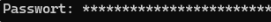

Anschließend ist das Zertifikat importiert

# Zertifikat erstellen

`zert` erstellt ein Zertifikat

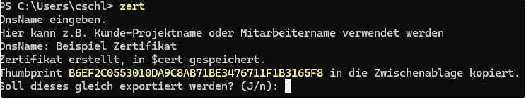

Danach den Namen des Zertifikats eingeben. Auf Wunsch kann dieses gleich exportiert werden (siehe unten)

# Zertifikat exportieren

`expzert` Exportiert ein Zertifikat. Wie beim Verschlüsseln werden die Zertifikate aufgelistet.

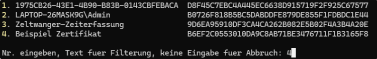

Anschließend den Zielort wählen und den Dateinamen eingeben (ohne Eingabe wird der Name des Zertifikats verwendet)

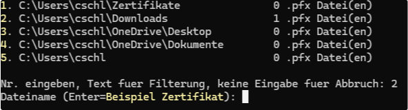

Anschließend noch ein Passwort festlegen und wiederholen.

> sollte sicher sein, nicht Suportis-2024 o.ä.
> Diese müssten ggfs. mit Kunden ausgetauscht werden, daher lieber ein komplexes Passwort wählen. Dieses wird nur einmal für den Import des Zertifikats benötigt. Also schön komplex.
> In einer kommenden Version kann hier auch ohne Eingabe automatisch ein Passwort erstellt und in die Zwischenablage kopiert werden)

Nun befindet sich die Zertifikat-Datei im gewählten Ordner.

Diese kann nun an Mitarbeiter und/oder Kunden geschickt werden. Zertifikat-Datei und Passwort immer getrennt versenden (Ideal eines per Mail, eines per Teams o.ä.)

# Verschlüsseln

`ver` fragt ob das gerade importierte Zertifikat verwendet werden soll bzw. listet die vorhandenen Zertifikate auf:

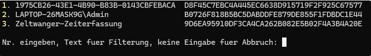

Alternativ kann auch `ver zelt` eingegeben werden. Der angegebene Name muss eindeutig sein!

Hier würde `ver z` reichen, gäbe es noch ein andere Zertifikat, z.B. `Zebra`, müsste min. `ver zel` eingegeben werden.

Als nächstes erfolgt die Eingabe des zu verschlüsselnden Textes. Ohne Eingabe wird der Inhalt der Zwischenablage verschlüsselt:

Beispiel: den nachfolgenden Text kopieren und bei der Eingabe nur <Enter> drücken.

```
Name: Beispiel
Vorname: Max
Passwort: GEHEIM!!!
```

Nach Eingabe von `ver` erscheint:

```
1. 1975CB26-43E1-4B90-B83B-0143CBFEBACA  D8F45C7EBC4A445EC6638D915719F2F925C67577
2. LAPTOP-26MASK9G\Admin                 B0726F818B5BC5DABDDFE879DE855F1FDBDC1E44
3. Zeltwanger-Zeiterfassung              9D6EA95910DF3CA4CA262B082E5B02F4A3B4A20E

Nr. eingeben, Text fuer Filterung, keine Eingabe fuer Abbruch: 3
Verschluesselung mit Zertifikat CN=Zeltwanger-Zeiterfassung
Zu verschluesselnden Text (Enter=aus der Zwischenablage):

-----BEGIN CMS-----
MIIB2wYJKoZIhvcNAQcDoIIBzDCCAcgCAQAxggFTMIIBTwIBADA3MCMxITAfBgNVBAMMGFplbHR3
YW5nZXItWmVpdGVyZmFzc3VuZwIQHw1FnBk/3bJHZkpQQba2MDANBgkqhkiG9w0BAQEFAASCAQBU
XtSFOJ279HvBVb6FVJKnU9PwbFNwRhOKDYy//7mMYXyYvucsoNNInDFfoXD15WZ1qmmRHrrav9AC
KliRVIB42zXbK2NMO8N/Wn3d0wegVjkmRM3GFcsueEPv7mSE6GjQc5udjViA/Ml/cIh8LVYlEbjG
VPurPzRwVEyBzg+zfPoHItCnintRCeajid/FMWe0kZV0nONKFmy/pfS2JWEJsZdFI/NfEOqc/4Q7
zjtN7ma0TYlFhzNp6oKZNt9Wzy3FCJSwnm9vrTkq5bjidGbpA1+PxRd8yx3AQX5gBwjilywsrL4X
Ba4LSzTCN2fTELCkYGM4Ns6uqUoLvzk5/YgcMGwGCSqGSIb3DQEHATAdBglghkgBZQMEASoEEM6z
/8Hnxy+yPMHsMz9+GzeAQOYDluOdJ8gjG0hRERpvB5R6EyKfjnwFs8sze+aKVdpNaeVsYvCkdY2y
FkiX5mtaS+owhPdhQjvJrYQeegOhDp0=
-----END CMS-----

Text verschluesselt, verschluesselter Text in die Zwischenablage kopiert
Soll der Text des CMS-String in die Zwischenablage kopiert werden? (J/n):
```

Mit `  (oder Enter) wird dieser CMS-String in die Zwischenablage kopiert.

> Beachten: Dieser CMS String kann nur entschlüsselt werden, wenn das Zeltwanger-Zeiterfassung Zertifikat importiert ist!

> Das Format der zu verschlüsselnden Texte ist frei. Es kann ein Wort sein, eine Zeichenfolge, ein komplexer Text oder Name: Wert Schlüsselpaare. Wie oben im Beispiel
> 
> Links vom Doppelpunkt steht der Name (z.B. Passwort, IP-Adresse, …)
> 
> Rechts vom Doppelpunkt steht dar Wert (z.B: “geheim”, “192.168.178.123”)

# Dateien Verschlüsseln

Nach der Angabe des Zertifikatsnamens kann noch ein Dateipfad angegeben werden. Diese Datei wird dann verschlüsselt.

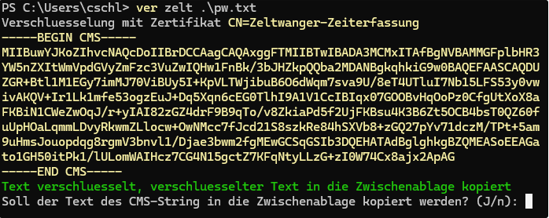

Hier bedarf es keinen Inhalt in der Zwischenablage o.ä.

Alternativ kann auch `ver -Path dateipfad` angegeben werden, dann kann das Zertifikat aus einer Liste ausgewählt werden.

> Die Angabe des Parameternamens -Path ist notwendig, da sonnst der Dateipfad als Zertifikatsname angesehen wird.

# Entschlüsseln

Text mit CMS-String in die Zwischenablage kopieren und enteingeben.

Bei mehrzeiligen Texten wird gefragt welche Zeile bzw. welche Inhalt NACH einem : kopiert werden soll.

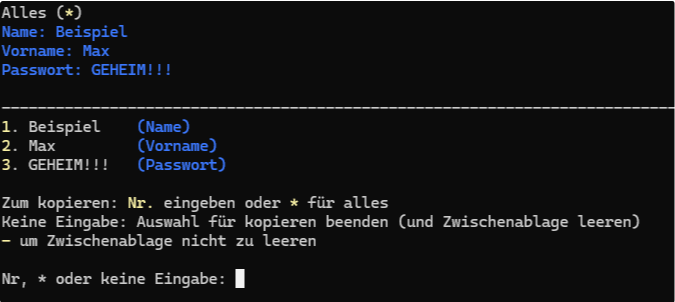

1. kopiert “Beispiel” (der Name)
2. kopiert “Max” (der Vorname)
3. kopiert “GEHEIM!!!” (das Passwort)

 ` *`  kopiert alles

Keine Eingabe beendet den Kopiervorgang und leer die Zwischenablage. Mit `-` kann das leeren der Zwischenablage umgangen werden.

# Entschlüsseln von Dateien

Auch hier: Nur den CMS-String in die Zwischenablage kopieren und ent eingeben.

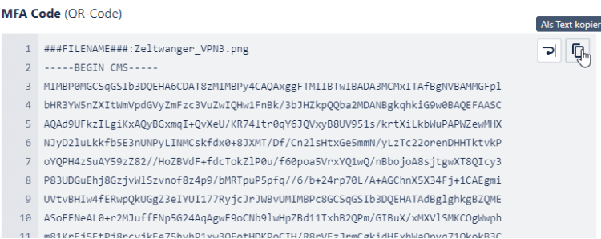
Wichtig ist: Das ###FILENAME### muss mit kopiert werden, damit erkannt wird, das es sich um eine Datei handelt.

Anschließend wird folgendes angezeigt:

![Optionen nach entschlüsseln einer Datei (Öffnen, Pfad öffnen/kopieren, Datei löschen)[pics/img13.png)

Hier kann mit

O die Datei geöffnet werden

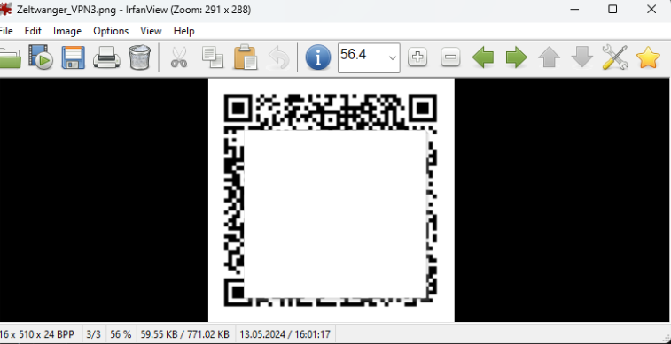

Je nach Typ wird das Bild angezeigt, Word oder Excel gestartet usw…

`P` Der Explorer mit dem Pfad in dem die Datei ist geöffnet

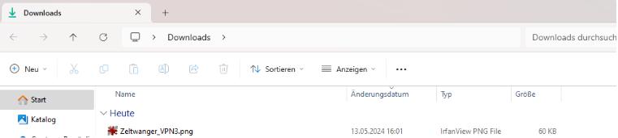

`k` Der Pfad der Datei in die Zwischenablage kopiert

`D` oder `L` Die Datei wird gelöscht und die Auswahl der Optionen wird beendet.

Enter Die Auswahl der Optionen wird beendet.

